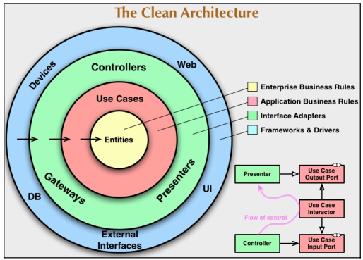

# Chapter 1 - Building Big with Go

1. High-level design: decomposition of the system into high-level components. 
2. Quality attributes: we want high quality code, this means no code checking would be allowed without unit tests and 90% code coverage.
3. Product velocity: the product has a bounded value in time, there should be CICD pipeline from the start.
4. A/B testing: every feature should have a flag, so that it can be shown only to an x percentage of users.

There are two key metrics for assessing how good you components are:
- **cohesion** - HIGH means a component performs a single related task,
- **coupling** - LOW means components should have less dependency between themselves.

The inner circles are more abstract, and deal with things such as business rules and policies. They are the least likely to change when something external changes.
The outer circles are mechanism. They define how the inner circles are fulfilled using the mechanism available.
Controles convert data from the formats available in the mechanism to what is most convenient for the business logic.

**DEPENDENCY RULE** - source code dependencies can only point inward. Nothing in the inner circle can know anything about something in an outer circle.

Synchronization issues:
- Deadlocks - two threads requesting resources in a slightly different pattern causes both to block;
- Priority inversion - a high priority process wait on a low-prority slow porcess;
- Starvation - a process occupies a resources for much more time than another equally important process;

